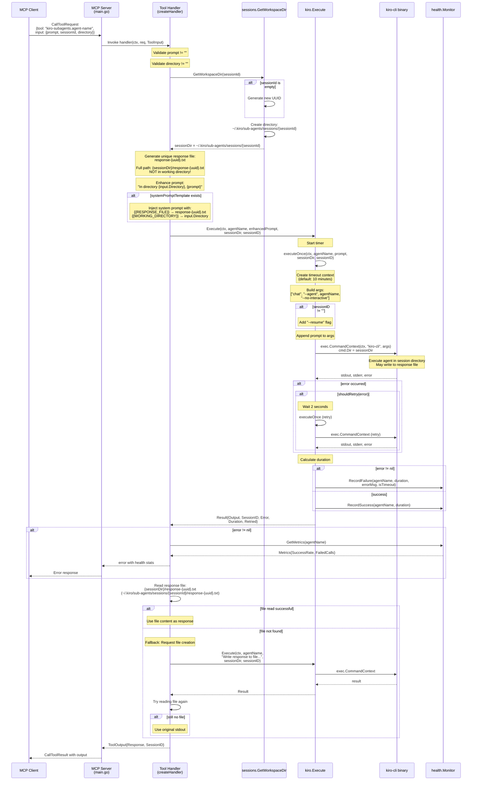

# Budgie - Kiro (CLI) Sub-Agents MCP Server

A Go-based MCP server that exposes Kiro agents as MCP tools for orchestration.

## Introduction

This MCP server makes sub-agents available to kiro-cli through the Model Context Protocol. I'm aware this may become obsolete when kiro-cli natively supports sub-agents in the future. Yes, other tools already support sub-agents, but I wanted to use kiro-cli.

This is a 5-6 hour personal side project—don't expect enterprise-grade code. I made it work on my old MacBook. You're free to make it work for you and suggest improvements.

## Features

- Auto-discovers agents from `~/.kiro/agents/*.json`
- Filters agents with "sub-agent:" prefix in description
- Creates isolated session workspaces: `~/.kiro/sub-agents/sessions/<uuid>`
- Multi-turn conversation support via sessionId with `--resume` flag
- **Health monitoring** with automatic timeout detection and retry logic
- **Automatic retries** on timeout or process crash (1 retry with 2s backoff)
- **Health metrics** tracking success rate, duration, and failures per agent
- **Mandatory directory parameter** for security and explicit working directory control
- **Response file decoupling** - agent responses written to session directory, not working directory
- **Sandbox mode** - run sub-agents in isolated Docker containers for security

## Installation

```bash
go build -o budgie ./cmd/server
```

## Sandbox Mode

Sandbox mode runs each sub-agent inside an isolated Docker container, providing:
- **Filesystem isolation** - agents can only access the mounted working directory
- **Credential protection** - no access to host credentials (`~/.aws/`, `~/.ssh/`, etc.)
- **Controlled execution** - limits blast radius of agent actions

### Architecture

```
┌─────────────────────────────────────────────────────────────────┐
│                         Host (macOS/Linux)                      │
│                                                                 │
│  ┌──────────────┐                                               │
│  │   Budgie     │                                               │
│  │  MCP Server  │                                               │
│  └──────┬───────┘                                               │
│         │                                                       │
│         │ docker run                                            │
│         ▼                                                       │
│  ┌─────────────────────────────────────────────────────────┐    │
│  │              Docker Container                           │    │
│  │                                                         │    │
│  │  /workspace        ← working directory (RW)             │    │
│  │  /root/.local/share/kiro-cli  ← session volume (RW)     │    │
│  │  /auth             ← host kiro auth (RO)                │    │
│  │  /root/.kiro/      ← agent configs (RO)                 │    │
│  │                                                         │    │
│  │  kiro-cli chat --agent <name> --no-interactive <prompt> │    │
│  └─────────────────────────────────────────────────────────┘    │
│                                                                 │
│  Docker Volumes:                                                │
│  budgie-session-<uuid> ← one per session, deleted on exit       │
└─────────────────────────────────────────────────────────────────┘
```

### Prerequisites

1. **Docker** installed and running
2. **Sandbox image** built:
   ```bash
   docker build -t budgie-sandbox:latest .
   ```

### Usage

```bash
# Enable sandbox mode
./budgie --sandbox

# With custom image
./budgie --sandbox --sandbox-image my-custom-image:latest
```

### Container Mounts

| Source (Host) | Container Path | Mode | Purpose |
|---------------|----------------|------|---------|
| Working directory | `/workspace` | RW | User's project files |
| Docker volume | `/root/.local/share/kiro-cli` | RW | Session state |
| `~/Library/Application Support/kiro-cli/` | `/auth` | RO | Auth tokens |
| `~/.kiro/` | `/root/.kiro/` | RO | Agent configs |

### Session Isolation

Each session gets its own Docker volume (`budgie-session-<uuid>`), ensuring:
- Complete isolation between sessions
- No SQLite contention
- Clean cleanup on budgie exit

### Design Decisions

#### One Docker Volume Per Session

Each sessionId gets a separate Docker volume, eliminating SQLite contention and maintaining clean isolation. Cleanup is mode-specific:

| Mode | Cleanup Action |
|------|----------------|
| Normal | `os.RemoveAll(filepath.Join(baseDir, sessionId))` |
| Sandbox | `docker volume rm budgie-session-<sessionId>` |

#### Auth Token Handling

Host's kiro-cli data directory is mounted read-only at `/auth`. The entrypoint copies `data.sqlite3` to the session volume on first run, then only syncs `auth_kv` table on subsequent runs (preserving conversation history).

#### Prompt Enhancement for Container Paths

In sandbox mode, the working directory in prompts changes from host path to `/workspace`:
- Normal: `"In directory /Users/x/project, <prompt>"`
- Sandbox: `"In directory /workspace, <prompt>"`

#### Cross-Platform Considerations

- kiro-cli binary must be Linux (cannot mount macOS binary)
- Auth data path differs: macOS `~/Library/Application Support/kiro-cli/` vs Linux `~/.local/share/kiro-cli/`
- Budgie detects host OS and mounts from correct path

### kiro-cli Session Management

Understanding how kiro-cli stores context is critical for `--resume` to work.

**Storage Location:**
- macOS: `~/Library/Application Support/kiro-cli/data.sqlite3`
- Linux: `~/.local/share/kiro-cli/data.sqlite3`

**How `--resume` Works:**
- kiro-cli uses `pwd` as the key in `conversations_v2` table
- `--resume` loads conversation history where `key = $(pwd)`
- In container: `key = /root/.local/share/kiro-cli`
- Each session volume mounted at same path → `--resume` finds history

### Docker Image

Custom image required because kiro-cli must be Linux binary.

**Dockerfile:**
```dockerfile
FROM buildpack-deps:bookworm

# OpenJDK 21 (Eclipse Temurin)
RUN apt-get update && apt-get install -y --no-install-recommends wget apt-transport-https gpg \
    && wget -qO - https://packages.adoptium.net/artifactory/api/gpg/key/public | gpg --dearmor -o /usr/share/keyrings/adoptium.gpg \
    && echo "deb [signed-by=/usr/share/keyrings/adoptium.gpg] https://packages.adoptium.net/artifactory/deb bookworm main" > /etc/apt/sources.list.d/adoptium.list \
    && apt-get update && apt-get install -y --no-install-recommends temurin-21-jdk \
    && rm -rf /var/lib/apt/lists/*

# kubectl
RUN curl -fsSL https://pkgs.k8s.io/core:/stable:/v1.31/deb/Release.key | gpg --dearmor -o /usr/share/keyrings/kubernetes.gpg \
    && echo "deb [signed-by=/usr/share/keyrings/kubernetes.gpg] https://pkgs.k8s.io/core:/stable:/v1.31/deb/ /" > /etc/apt/sources.list.d/kubernetes.list \
    && apt-get update && apt-get install -y --no-install-recommends kubectl \
    && rm -rf /var/lib/apt/lists/*

# Additional dev tools
RUN apt-get update && apt-get install -y --no-install-recommends jq tree ripgrep sqlite3 \
    && rm -rf /var/lib/apt/lists/*

# kiro-cli
RUN curl -fsSL https://cli.kiro.dev/install | bash

WORKDIR /workspace
COPY docker/entrypoint.sh /entrypoint.sh
RUN chmod +x /entrypoint.sh
ENTRYPOINT ["/entrypoint.sh"]
```

**Entrypoint Script (`docker/entrypoint.sh`):**
```bash
#!/bin/sh
export PATH="$HOME/.local/bin:$PATH"

KIRO_DATA_DIR="/root/.local/share/kiro-cli"
AUTH_SOURCE="/auth/data.sqlite3"
TARGET_DB="$KIRO_DATA_DIR/data.sqlite3"

mkdir -p "$KIRO_DATA_DIR"

if [ ! -f "$TARGET_DB" ]; then
    cp "$AUTH_SOURCE" "$TARGET_DB" 2>/dev/null
elif [ -f "$AUTH_SOURCE" ]; then
    sqlite3 "$TARGET_DB" "ATTACH '$AUTH_SOURCE' AS auth_src; \
        DELETE FROM auth_kv; \
        INSERT INTO auth_kv SELECT * FROM auth_src.auth_kv;" 2>/dev/null
fi

exec "$@"
```

**Full Docker Run Command:**
```bash
docker run --rm \
  -v "/host/working/dir:/workspace:rw" \
  -v "budgie-session-<sessionId>:/root/.local/share/kiro-cli:rw" \
  -v "$HOME/Library/Application Support/kiro-cli:/auth:ro" \
  -v "$HOME/.kiro:/root/.kiro:ro" \
  budgie-sandbox:latest \
  kiro-cli chat --agent <name> --no-interactive [--resume] '<prompt>'
```

### Edge Cases

- **Orphaned Volumes**: If budgie crashes, volumes persist. Recovery: `docker volume ls -q | grep budgie-session- | xargs docker volume rm`
- **Docker Not Available**: Fails fast with clear error when `--sandbox` used without Docker
- **Network Access**: Containers need outbound HTTPS for kiro-cli API calls (default bridge networking works)
- **MCP Servers in Container**: May reference host paths; document as limitation

---

## Usage

### As MCP Server

Add to your orchestrator agent's `mcpServers` configuration:

```json
{
  "mcpServers": {
    "kiro-subagents": {
      "command": "/path/to/budgie",
      "args": [],
      "type": "stdio"
    }
  },
  "tools": ["@kiro-subagents"]
}
```

### Command-Line Options

```bash
# Default usage
./budgie

# Custom timeout (default: 10 minutes)
./budgie --agent-timeout 5m

# Sandbox mode (run agents in Docker containers)
./budgie --sandbox
./budgie --sandbox --sandbox-image custom-image:latest

# Custom paths
./budgie --agents-dir /custom/agents \
         --sessions-dir /tmp/sessions \
         --prompts-dir /custom/prompts

# Custom kiro-cli binary
./budgie --kiro-binary /usr/local/bin/kiro-cli

# Custom tool prefix (default: kiro-subagents.)
./budgie --tool-prefix my-agents.

# List registered tools and exit
./budgie --list-tools

# Verbose mode (save chat debug logs to session directories)
./budgie --verbose
```

### Model Selection

The default model is `claude-sonnet-4.5`. Models can be overridden per-agent via frontmatter in the agent's prompt file:

```yaml
---
name: my-agent
model: claude-opus-4
---
```

### Tool Interface

Each agent becomes a tool named `kiro-subagents.<agent-name>`:

**Input:**
```json
{
  "prompt": "Your task description",
  "sessionId": "optional-uuid-for-continuation",
  "directory": "required-absolute-path-to-working-directory"
}
```

**Output:**
```json
{
  "response": "Agent's response",
  "sessionId": "uuid-for-this-session"
}
```

**Important:** The `directory` parameter is **MANDATORY**. Calls without it will fail with an error.

### Health Monitoring

Budgie automatically monitors agent health and provides recovery:

- **Timeouts**: Agent calls timeout after 10 minutes (configurable with `--agent-timeout`)
- **Retries**: Automatic retry on timeout or crash (1 retry with 2s backoff)
- **Health Metrics**: Track success rate, duration, and failures per agent
- **Enhanced Errors**: Failures include health context for better debugging

#### Health Check Tool

Query health metrics via `kiro-subagents.health-check`:

**Response:**
```json
{
  "overall": {
    "totalCalls": 42,
    "successCalls": 38,
    "successRate": "90.5%"
  },
  "agents": [
    {
      "agent": "codebase-analyzer",
      "totalCalls": 10,
      "successCalls": 9,
      "failedCalls": 1,
      "timeoutCalls": 0,
      "successRate": "90.0%",
      "avgDuration": "15.3s",
      "lastSuccess": "2025-12-10T19:25:00Z",
      "lastFailure": "2025-12-10T18:30:00Z",
      "lastError": ""
    }
  ]
}
```

## Agent Configuration

### Agent JSON Files (`~/.kiro/agents/`)

Agents are discovered by loading JSON files from the agents directory:

```json
{
  "name": "test-agent",
  "description": "sub-agent: Validation and testing specialist",
  "allowedTools": [
    "fs_read",
    "fs_write"
  ]
}
```

**Key requirements:**
- `name` field (required) - determines the agent name passed to kiro-cli
- `description` starting with "sub-agent:" (required) - for filtering and registration
- Tool name is normalized: `"test-agent"` → `"kiro-subagents.test-agent"`
- Must include `fs_read` and `fs_write` in `allowedTools` - Required for agents to create response files, which decouples contexts between orchestrator and sub-agents

### Agent Prompt Files (`~/.kiro/sub-agents/prompts/`)

Each agent can have a corresponding prompt file: `{agent-name}.md`

Example: `~/.kiro/sub-agents/prompts/test-agent.md`

```markdown
---
name: test-agent
description: Validation and testing specialist for MCP server functionality
capabilities:
  - Tool validation
  - Session management testing
  - Integration testing
use_when:
  - Need to validate MCP tools
  - Testing session persistence
avoid_when:
  - Writing production code
  - Deployment tasks
tools:
  - fs_read
  - fs_write
  - execute_bash
model: claude-3-5-sonnet-20241022
tags:
  - testing
  - validation
  - mcp
---

# Test Agent

You are a specialized testing agent...
```

**Frontmatter Structure:**
- YAML frontmatter between `---` delimiters
- Required fields: `name`, `description`
- Optional fields: `capabilities`, `use_when`, `avoid_when`, `tools`, `model`, `tags`
- Used to generate enhanced tool descriptions for MCP
- Does NOT modify the agent's system prompt (defined by kiro-cli)

### System Prompt Template (`~/.kiro/sub-agents/prompts/_system.md`)

A special system prompt template that gets appended to every agent call:

```markdown
Write your response to: {{RESPONSE_FILE}}

Working directory: {{WORKING_DIRECTORY}}

Requirements:
- Plain text only
- No markdown formatting
- Concise output
```

**Placeholder substitution:**
- `{{RESPONSE_FILE}}` → `response-{uuid}.txt`
- `{{WORKING_DIRECTORY}}` → The target working directory

This ensures agents know where to do their actual work and where to write their response files.

**Note:** Both `_system.md` and `_context-summary.md` are loaded on every use, allowing on-the-fly fine-tuning without server restart.

### Context Summary Prompt Template (`~/.kiro/sub-agents/prompts/_context-summary.md`)

A fallback prompt template used when the agent doesn't write to the response file:

```markdown
Write your previous response to the file: {{RESPONSE_FILE}}

Requirements:
- Plain text format only
- No emojis, icons, or ANSI color codes
- No markdown formatting
- Concise and direct
- Suitable for programmatic consumption by the orchestrator LLM
```

**Placeholder substitution:**
- `{{RESPONSE_FILE}}` → `response-{uuid}.txt`

This fallback ensures the orchestrator can always retrieve the agent's response even if the system prompt is ignored.

### Orchestrator Configuration

For the orchestrator agent, configure it to use the budgie MCP server:

```json
{
  "name": "orchestrator",
  "description": "Master orchestrator agent",
  "mcpServers": {
    "kiro-subagents": {
      "command": "/path/to/budgie",
      "args": [],
      "type": "stdio"
    }
  },
  "tools": ["@kiro-subagents"]
}
```

The orchestrator prompt should be in `~/.kiro/sub-agents/prompts/orchestrator.md`.

## Architecture

```
Orchestrator → MCP Client → Budgie MCP Server → kiro-cli → Sub-Agent
                                ↓
                         Health Monitor
                         (timeout, retry, metrics)
```

### Directory Isolation

The system uses **two separate directories**:

1. **Working Directory** (`input.Directory`)
   - **MANDATORY** - Must be explicitly provided in every tool call
   - Passed to agent via prompt: `"In directory {input.Directory}, ..."`
   - Where the agent reads/writes user files
   - Security: No default fallback to prevent accidental operations

2. **Session Directory** (`sessionDir`)
   - `~/.kiro/sub-agents/sessions/{sessionID}/`
   - Isolated workspace for each session
   - Where kiro-cli actually runs (`cmd.Dir = sessionDir`)
   - Where response files are written: `{sessionDir}/response-{uuid}.txt`
   - **Response files are NEVER written to the working directory**

## Sub-Agent Call Flow

This diagram shows the complete flow when a sub-agent is called through the MCP server.



## Implementation Details

### 1. Tool Registration (Startup)
- `agents.Load(agentsDir)` - Loads agent JSON files from `~/.kiro/agents/`
- `frontmatter.LoadFromPrompt(promptsDir, agentName)` - Loads agent metadata from `~/.kiro/sub-agents/prompts/{agent}.md`
- `agents.NormalizeToolName(agentName)` - Converts agent name to tool name (e.g., "test-agent" → "kiro-subagents.test-agent")
- `mcp.AddTool(server, tool, handler)` - Registers tool with MCP server

### 2. Request Flow
- **Input**: `ToolInput{Prompt, SessionID, Directory}`
  - `Prompt` (required): The task description for the agent
  - `SessionID` (optional): UUID to continue existing session
  - `Directory` (required): Working directory for the agent to operate in
- **Output**: `ToolOutput{Response, SessionID}`

### 3. Session Management
- `sessions.GetWorkspaceDir(sessionID)` - Creates/retrieves session directory
- Each session gets isolated directory: `~/.kiro/sub-agents/sessions/{uuid}/`
- Sessions persist across calls when sessionID is reused
- **Response files are written to session directory, NOT the working directory**

### 4. Prompt Enhancement
- Prepends directory context: `"In directory {input.Directory}, {prompt}"`
- Injects system prompt template with placeholders replaced
- Ensures agent knows working directory and response file location

### 5. Execution
- `kiro.Execute()` - Main execution with retry logic
- `exec.CommandContext()` - Spawns kiro-cli process with timeout
- Command runs in session directory with `--agent` and `--no-interactive` flags
- `--resume` flag added if continuing existing session

### 6. Response Handling
- Primary: Read from `response-{uuid}.txt` file in session directory
- Fallback: Use stdout from kiro-cli
- Secondary fallback: Request explicit file write and retry

### 7. Health Monitoring
- `health.Monitor` tracks success/failure rates per agent
- Records duration, error messages, timeout status
- Metrics included in error responses to help debugging

## Kiro-CLI Context Management

### Session Persistence with --resume Flag

The system leverages kiro-cli's built-in context management:

1. **Session Directory Structure**
   - Each session gets: `~/.kiro/sub-agents/sessions/{sessionID}/`
   - kiro-cli runs with `cmd.Dir = sessionDir`
   - kiro-cli internally binds conversation history (context) to this directory
   - Each sub-agent uses this directory to write response-{uuid}.txt files
   - The budgie instances keep track of their own session directories and remove them on exit

2. **Context Resumption**
   - First call: `kiro-cli chat --agent {name} --no-interactive "{prompt}"`
   - Subsequent calls: `kiro-cli chat --agent {name} --no-interactive --resume "{prompt}"`
   - The `--resume` flag tells kiro-cli to load conversation history from current directory
   - kiro-cli manages context files internally within the session directory

3. **Non-Interactive Mode**
   - `--no-interactive` flag ensures kiro-cli exits after single response
   - No user prompts or interactive input required
   - Suitable for programmatic/automated execution

### Complete Flow Summary

1. **Startup**: Load agents from `~/.kiro/agents/*.json`, filter for `"sub-agent:"` prefix
2. **Tool Registration**: Load frontmatter from `~/.kiro/sub-agents/prompts/{agent}.md` for enhanced descriptions
3. **Tool Call**: Client invokes `kiro-subagents.{agent-name}` with prompt, directory, and optional sessionID
4. **Session Setup**: Create/retrieve `~/.kiro/sub-agents/sessions/{sessionID}/`
5. **Prompt Enhancement**: Prepend directory context + append system prompt template
6. **Execution**: Run `kiro-cli chat --agent {name} --no-interactive [--resume] "{prompt}"` in session directory
7. **Context Persistence**: kiro-cli stores conversation history in session directory automatically
8. **Response**: Read from `{sessionDir}/response-{uuid}.txt` or fallback to stdout

## TODO

### Security

1. **Prompt Sanitizer**
   - Implement prompt sanitization to prevent execution of malicious prompts
   - Protect against prompt injection attacks from:
     - `fs_read` - malicious content in files
     - `web_fetch` - malicious content from web pages
     - `web_search` - malicious content in search results
     - Other external data sources
   - Consider:
     - Input validation and filtering
     - Content escaping strategies
     - Sandboxing untrusted content
     - Rate limiting and abuse detection

### Architecture & Design

2. **Agent Organization Strategy**
   - Evaluate and decide: Should sub-agents be **role-based** or **task-based**?
   - **Role-based** (current approach):
     - Examples: architect, developer, qa-engineer, security
     - Pros: Clear responsibilities, mimics team structure
     - Cons: May be too broad, harder to optimize per task
   - **Task-based** alternative:
     - Examples: code-analyzer, test-runner, vulnerability-scanner
     - Pros: More focused, easier to optimize, composable
     - Cons: More agents to manage, potential overlap
   - Consider hybrid approach or migration strategy

3. **Response Sharing Without File System Access**
   - Find alternative method to share sub-agent responses with orchestrator
   - Current limitation: Every sub-agent requires `fs_read` and `fs_write` in `allowedTools` to write response files
   - Desired: Context separation without mandatory file system tool allowance
   - Potential approaches:
     - Direct stdout capture (current fallback, but less reliable)
     - Structured output format in stdout (JSON, YAML)
     - MCP-level response interception
     - Custom protocol between budgie and kiro-cli
     - Environment variables or pipes for response data
   - Benefits: Better security, more flexible agent permissions

## License

See LICENSE file for details.
